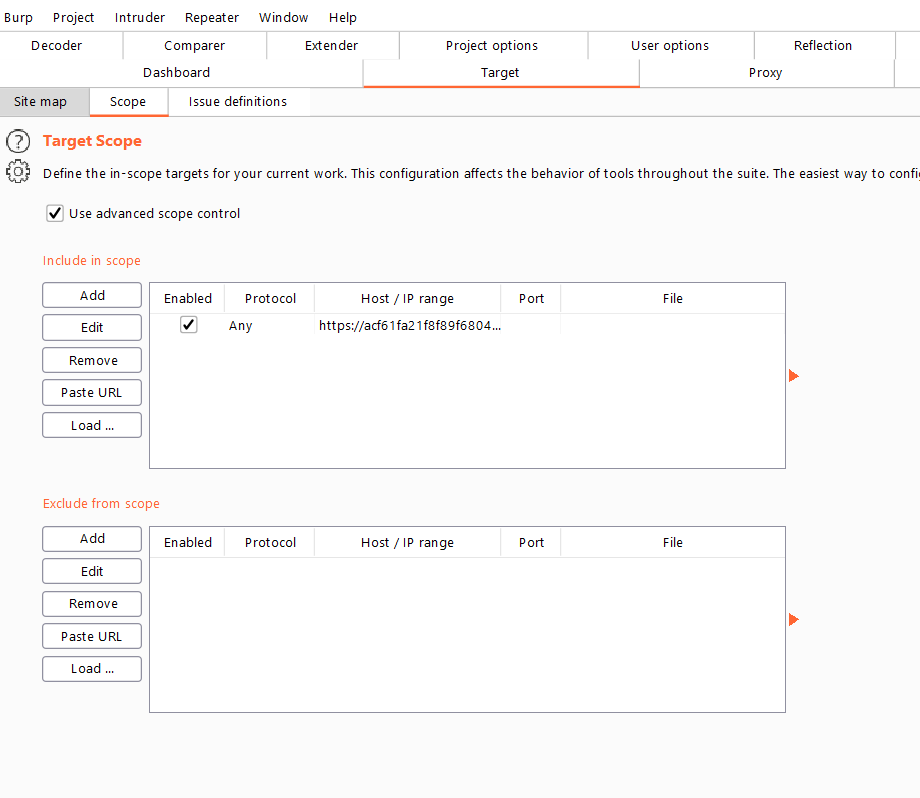
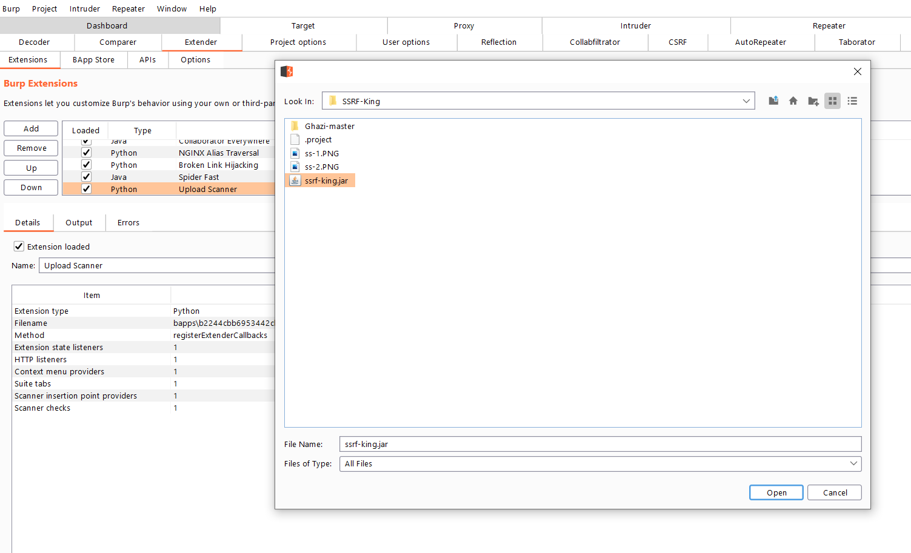
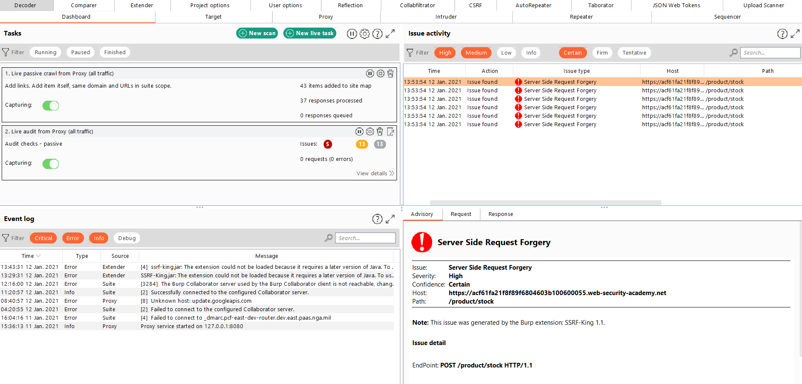
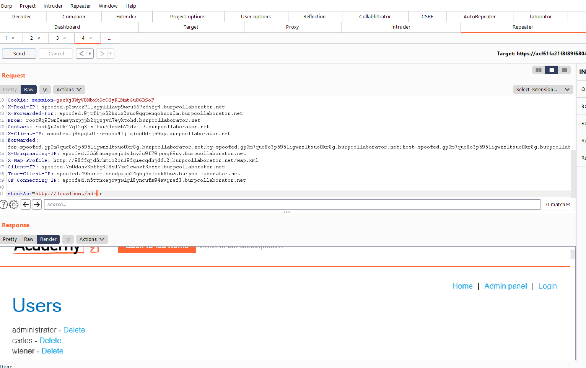

# 🔥 ssrf-king 🔥
[](https://opensource.org/licenses/MIT)
### v1.12 Latest
SSRF plugin for burp that Automates SSRF Detection in all of the Request


**If you are facing any problems or would like a new feature that is not listed below**
**Please create a new issue below in the form**

**[Create New Issue](https://github.com/ethicalhackingplayground/ssrf-king/issues/new)**

### Upcoming Features Checklist
* ✔️ It will soon have a user Interface to specifiy your own call back payload 
* It will soon be able to test Json & XML

### Features

* ✔️ Test all of the request for any external interactions.
* ✔️ Checks to see if any interactions are not the users IP if it is, it's an open redirect.
* ✔️ Alerts the user for any external interactions with information such as:
  - Endpoint Vulnerable
  - Host
  - Location Found
  
It also performs the following tests based on this research:

**Reference:**

https://portswigger.net/research/cracking-the-lens-targeting-https-hidden-attack-surface

```http
GET http://burpcollab/some/endpoint HTTP/1.1
Host: example.com
...
```
and
```http
GET @burpcollab/some/endpoint HTTP/1.1
Host: example.com
...
```
and
```http
GET /some/endpoint HTTP/1.1
Host: example.com:80@burpcollab
...
```
and
```http
GET /some/endpoint HTTP/1.1
Host: burpcollab
...
```
and
```http
GET /some/endpoint HTTP/1.1
Host: example.com
X-Forwarded-Host: burpcollab
...
```

### Scanning Options

* ✔️ Supports Both Passive & Active Scanning.

### Dependencies

Works only with
* JDK 11
* Burp Professional

Tested with Burp Professional v2020.11.2

### Process to Use it.

* Load the website you want to test.


* Add it as an inscope host in burp.



* Load the plugin.



* Keep note of the Burp Collab Payload.


* Passively crawl the page, ssrf-king test everything in the request on the fly.


* When it finds a vulnerabilitiy it logs the information and adds an alert.




**From here onwards you would fuzz the parameter to test for SSRF.**




**If you get a bounty please support by buying me a coffee**

<br>
<a href="https://www.buymeacoffee.com/krypt0mux" target="_blank"></a>
